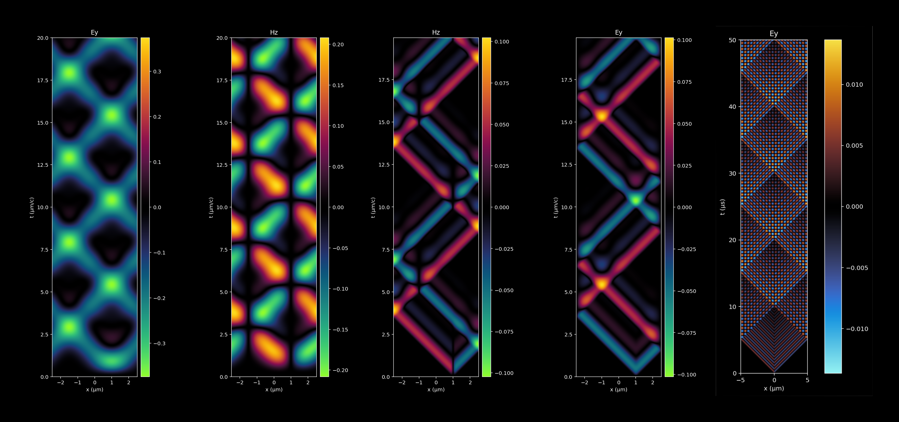
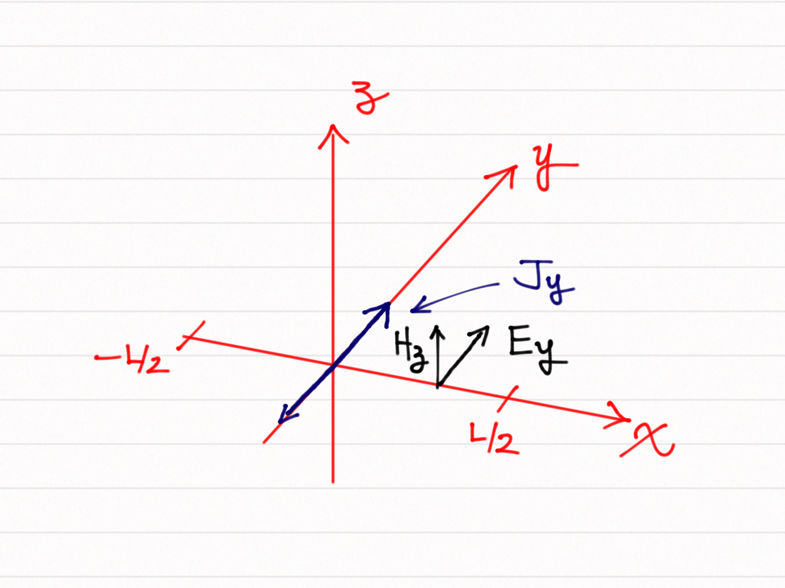

# fdtdpie 

`fdtdpie` is an elementary implementation of the finite-difference time-domain method for the numerical solution of Maxwell's equations. 

In the two extremes of the one-dimensional domain in which it solves Maxwell's equations, it implements two different types of boundary conditions: periodic boundary conditions, and metallic boundary conditions.

For simplicity it assumes that the currents that are set up are perpendicular to the solution domain. As such the fields that it solves for are the electric field Ey that is perpendicular to the length of the simulation domain, and the H-field that would accompany it.

In the units assumed here, the speed of light is taken to be unity, so that whatever unit of length one is assuming in the simulation, the time unit would be equal to that unit over c.

In `fdtdpie` one may setup up a simulation by using the `FD1D` class, in which one may setup a current density (given as a function of time and position), the relative permitivity of the medium (given as a function of position), the length of the simulation region, the resolution `dx` at which the simulation is run, and the type of boundary conditions one wishes to use. For examples of how to use `fdtdpie`, see the [FDTPpie.ipynb](./FDTDpie.ipynb) notebook.

